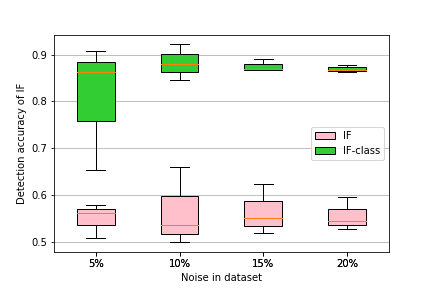

# Class based Influence Functions for Error Detection
## Overview
This code for the paper: [Class based Influence Functions for Error Detection](https://arxiv.org/abs/2305.01384).

The 61st Annual Meeting of the Association for Computational Linguistics (ACL 2023)

Influence functions (IFs) are a powerful tool for estimating the influence of a data point on another data point.
IFs are widely used in machine learning, especially for detecting anomalous examples.
However, they are unstable when applied to deep networks.
In this paper, we provide an explanation of the instability of IFs and develop a solution to this problem.
We show that IFs are unreliable when the two data points belong to two different classes.
Our solution leverages class information to improve the stability of IF.
Extensive experiments show that our modification significantly improves the performance and stability of IFs while incurring no additional computational cost.

## Run code
### Create datasets
Firstly, create noise data and clean data. You can using files in `utils` folder to create them from origin data.

### Classification Problems
- Config model into `models` folder and dataloader into `dataloader` folder. Config load, build methods into `baseline.py`, demo config for `experiments` folder.
- Train model using `train.py`.
- Run to get gradients: `gradients.py`.
- Read result: `convert_result.py`.

### Sequence Problems
The sequence problems is NER, POS tagging, ...in NLP. We experiment on the CoNLL2003 dataset. 

- `ner_train.py` : Train NER model.
- `ner_gradients.py`: Build gradient of noise data and clean data.
- `ner_buld_stest.py`: Build stest for calculating IF.
- `ner_influence.py`: Get scores of methods after have gradient informations.

## Some results
### Detection accuracy of methods
We experiment methods as: IF, GD, GC, and TracIn.

Error detection accuracy on datasets with noise $p=20\%$:

BigClone            |  IMDB | SNLI
:-------------------------:|:-------------------------:|:-------------------------:
  |   | 
### Detection accuracy when changing the noise ratio of the data
Change in error detection accuracy on the datasets as the level of noise changes.
BigClone            |  IMDB | SNLI
:-------------------------:|:-------------------------:|:-------------------------:
  |   |  

---
In addition, we also experiment on sequence data such as CoNLL2003 NER
CoNLL2003            |  CoNLL2003 | CoNLL2003
:-------------------------:|:-------------------------:|:-------------------------:
  |   |  

---
© 2023 by FPT Software AI Center (FSoft - AIC). All Rights Reserved.